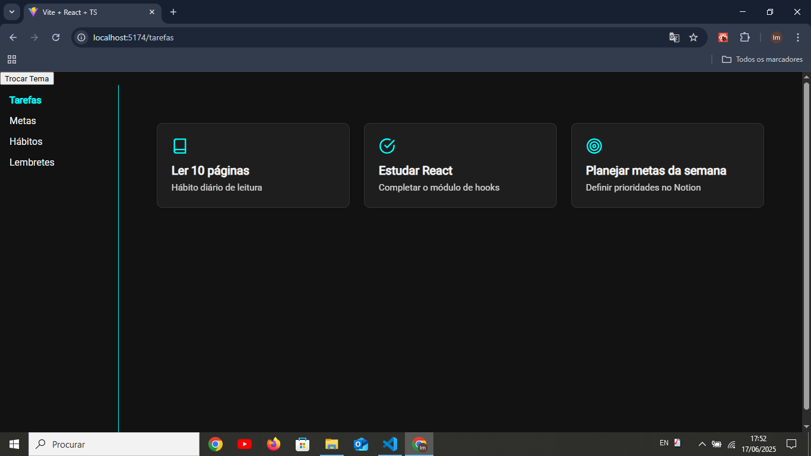

# 🧠 Desperta

# 🧠 Desperta

<p align="center">
  
</p>


**Desperta** é uma aplicação de produtividade pessoal voltada para o gerenciamento de tarefas, hábitos, lembretes e metas. A proposta é oferecer uma interface simples, leve e eficaz para organizar sua rotina diária, semanal ou anual.

## 🚀 Funcionalidades

- ✅ Gerenciamento de **Tarefas** com status (pendente/concluída)
- 🔁 Acompanhamento de **Hábitos**
- ⏰ Criação e visualização de **Lembretes**
- 🎯 Definição de **Metas**
- 📊 Visualização de progresso
- 🌗 Suporte a tema claro/escuro

## 🖼️ Layout

A estrutura visual é pensada para facilitar a navegação em diferentes dispositivos (responsivo), com os seguintes componentes principais:

- **Header**
- **Sidebar**
- **Bottom Navigation**
- **Floating Add Button**
- **Cards de conteúdo**

## 📁 Estrutura do Projeto

```bash
/src
 ├── components/
 │    ├── Button/
 │    ├── Card/
 │    ├── Header/
 │    └── Sidebar/
 ├── pages/
 │    ├── Tarefas.tsx
 │    ├── Habitos.tsx
 │    ├── Lembretes.tsx
 │    └── Metas.tsx
 ├── styles/
 │    ├── GlobalStyle.ts
 │    ├── styled.d.ts
 │    └── theme.ts
 └── App.tsx
🛠️ Tecnologias Utilizadas
React com TypeScript

Vite como bundler

Styled-components para estilização

ESLint e Prettier para padronização de código

🧪 Como Rodar o Projeto Localmente
1. Clone o repositório

git clone https://github.com/dev-nascimento-s/desperta.git

2. Instale as dependências
cd desperta
npm install

3. Inicie o servidor de desenvolvimento
npm run dev

Acesse: http://localhost:5173 no navegador.

💡 Melhorias Futuras
Sistema de notificações e alertas

Autenticação de usuários

Armazenamento em nuvem (ex: Firebase)

Estatísticas e relatórios

Suporte a múltiplos idiomas

📄 Licença
Distribuído sob a licença MIT. Veja LICENSE para mais informações.


---

### 📄 `LICENSE`

Salve este conteúdo em um arquivo chamado `LICENSE` (sem extensão), também na raiz do projeto:

```text
MIT License

Copyright (c) 2025 Sebastião Nascimento

Permission is hereby granted, free of charge, to any person obtaining a copy
of this software and associated documentation files (the “Software”), to deal
in the Software without restriction, including without limitation the rights
to use, copy, modify, merge, publish, distribute, sublicense, and/or sell
copies of the Software, and to permit persons to whom the Software is
furnished to do so, subject to the following conditions:

The above copyright notice and this permission notice shall be included in
all copies or substantial portions of the Software.

THE SOFTWARE IS PROVIDED “AS IS”, WITHOUT WARRANTY OF ANY KIND, EXPRESS OR
IMPLIED, INCLUDING BUT NOT LIMITED TO THE WARRANTIES OF MERCHANTABILITY,
FITNESS FOR A PARTICULAR PURPOSE AND NONINFRINGEMENT. IN NO EVENT SHALL THE
AUTHORS OR COPYRIGHT HOLDERS BE LIABLE FOR ANY CLAIM, DAMAGES OR OTHER
LIABILITY, WHETHER IN AN ACTION OF CONTRACT, TORT OR OTHERWISE, ARISING FROM,
OUT OF OR IN CONNECTION WITH THE SOFTWARE OR THE USE OR OTHER DEALINGS IN
THE SOFTWARE.
